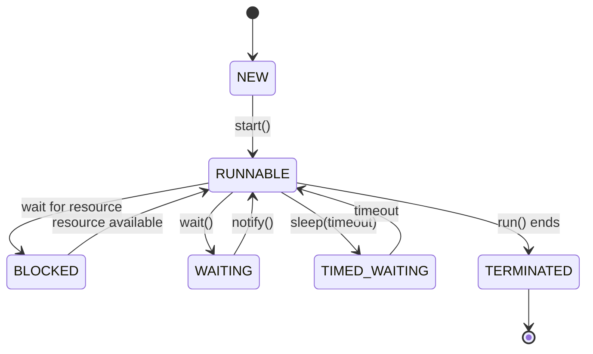

# Основы языка Java

## Байт-код и интерпретируемый язык

- Java-программы компилируются в байт-код, выполняемый JVM.
- Байт-код платформенно независим, интерпретируется или компилируется JIT-компилятором.

## Отличительные особенности Java

- **Платформенная независимость**: Программы выполняются на любом устройстве с JVM.
- **Объектно-ориентированность**: Всё строится на объектах и классах.
- **Автоматическое управление памятью**: Сборка мусора удаляет неиспользуемые объекты.
- **Безопасность**: JVM изолирует выполнение кода, предотвращая угрозы.
- **Богатая стандартная библиотека**: API для работы с сетью, потоками, GUI и др.

## Программная платформа и JVM

- Java Platform включает JVM и стандартные библиотеки.
- JVM исполняет байт-код, управляет памятью и выполняет сборку мусора.

## Сборка мусора

- Упрощает управление памятью: удаляет объекты, на которые нет ссылок.

## Особенности лексики Java

- **Литералы**: Числа (`42`), строки (`"Hello"`), булевы (`true`, `false`).
- **Идентификаторы**: Имена переменных/методов, начинаются с буквы, `_` или `$`.
- **Разделители**: `{}`, `[]`, `;` структурируют код.
- **Комментарии**:
  - Однострочные: `// комментарий`.
  - Многострочные: `/* комментарий */`.
  - Документирующие: `/** комментарий */`.
- **Ключевые слова**: Зарезервированные (`class`, `if`, `else`, `void` и др.).

# Примитивные типы данных, переменные и строки

## Примитивные типы данных Java

Java предоставляет 8 примитивных типов:

- **Целочисленные**: `byte` (1 байт), `short` (2 байта), `int` (4 байта), `long` (8 байт).
- **С плавающей точкой**: `float` (4 байта), `double` (8 байт).
- **Символьный**: `char` (2 байта, символ Unicode).
- **Логический**: `boolean` (`true` или `false`).

Примитивные типы обеспечивают высокую производительность, так как хранятся в стековой памяти и не зависят от объекта.

## Особенности применения типа данных String в Java

`String` — неизменяемый объектный тип, используемый для работы со строками. Особенности:

- При изменении строки создаётся новый объект.
- Удобные методы:
  - `length()` — длина строки.
  - `charAt(index)` — символ по индексу.
  - `substring(start, end)` — подстрока.
  - `equals()` — сравнение строк.
  - `toUpperCase()` и `toLowerCase()` — изменение регистра.
- Строки кешируются в пуле строк, что оптимизирует память.

## Назначение и методы класса Object

`Object` — базовый класс для всех объектов в Java. Его методы:

- `toString()` — возвращает строковое представление объекта.
- `equals(Object obj)` — проверяет равенство объектов.
- `hashCode()` — возвращает хэш-код объекта.
- `clone()` — создает копию объекта (требует реализации интерфейса `Cloneable`).

## Переменные

Переменные — это именованные области памяти для хранения данных.

- Объявляются с указанием типа: `int age = 25;`.
- Тип переменной определяет объем памяти и возможные операции.

## Преобразование и приведение типов

Java поддерживает:

- **Неявное преобразование (widening)**: от меньшего к большему (`int` → `long`).
- **Явное приведение (casting)**: от большего к меньшему (`double` → `(int)`).

## Автоматическое продвижение типов в выражениях

Если в выражении участвуют разные типы, Java автоматически продвигает их к наиболее вместительному:

- Примеры:
  - `int + double → double`.
  - `byte + int → int`.
  - `char` преобразуется в `int` при арифметических операциях.

# Операторы и управляющие конструкции

## Операции

### Арифметические

Используются для математических операций:

- `+` (сложение), `-` (вычитание), `*` (умножение), `/` (деление), `%` (остаток от деления).

### Поразрядные

Работают на уровне битов:

- `&` (И), `|` (ИЛИ), `^` (Исключающее ИЛИ), `~` (инверсия).
- Сдвиги: `<<` (влево), `>>` (вправо с сохранением знака), `>>>` (вправо без сохранения знака).

### Отношения

Сравнивают значения:

- `<`, `>`, `<=`, `>=`, `==` (равно), `!=` (не равно).

### Логические

Применяются для работы с булевыми значениями:

- `&&` (логическое И), `||` (логическое ИЛИ), `!` (логическое НЕ).

### Присваивание

- `=`: Присваивает значение переменной.
- Сокращенные формы: `+=`, `-=`, `*=`, `/=`, `%=` и т. д.

---

## Управляющие операторы

### Операторы выбора

- **`if-else`**: Выполняет код в зависимости от условия.
- **`switch`**: Выбор одного из множества вариантов на основе значения.

### Операторы циклов

- **`for`**: Итерационный цикл.

  ```java
  for (int i = 0; i < 10; i++) { ... }
  ```

- **`while`**

  ```java
  while (condition) {
    // Код выполняется, пока условие истинно
  }
  ```

- **`while`**
  ```java
  do {
    // Код выполняется хотя бы один раз
  } while (condition);
  ```

### Операторы перехода

- break: Прерывает выполнение цикла или switch.
- continue: Пропускает оставшийся код текущей итерации.
- return: Возвращает значение из метода.

### Управляющие операторы в Java

1. **Операторы выбора**:

   - Используются для ветвления выполнения программы.
   - Примеры: `if`, `if-else`, `switch`.

   ```java
   if (условие) {
       // блок кода, если условие истинно
   } else {
       // блок кода, если условие ложно
   }

   // switch
   switch (выражение) {
       case значение1:
           // блок кода
           break;
       case значение2:
           // блок кода
           break;
       default:
           // блок кода
   }
   ```

2. **Операторы цикла**:

   - Для повторения блока кода.
   - Примеры: `for`, `while`, `do-while`.

   ```java
   // for
   for (int i = 0; i < 10; i++) {
       System.out.println(i);
   }

   // while
   int i = 0;
   while (i < 10) {
       System.out.println(i);
       i++;
   }

   // do-while
   int j = 0;
   do {
       System.out.println(j);
       j++;
   } while (j < 10);
   ```

3. **Операторы перехода**:

   - Для управления потоком выполнения программы.
   - Примеры: `break`, `continue`, `return`.

   ```java
   for (int i = 0; i < 10; i++) {
       if (i == 5) break; // завершение цикла
       if (i % 2 == 0) continue; // пропуск итерации
       System.out.println(i);
   }
   ```

---

### Массивы

1. **Объявление массива**:  
   Массив — это структура данных, которая хранит элементы одного типа.

   ```java
   // Синтаксис
   тип[] имяМассива;
   тип имяМассива[];

   // Пример
   int[] numbers;
   String[] names;
   ```

2. **Инициализация массива**:  
   Массив можно инициализировать как с указанием размера, так и с набором значений.

   ```java
   // С указанием размера
   int[] numbers = new int[5]; // массив на 5 элементов

   // С набором значений
   int[] numbers = {1, 2, 3, 4, 5};

   // Создание с оператором new
   String[] names = new String[]{"Alice", "Bob", "Charlie"};
   ```

3. **Индекс массива**:  
   Индексы массива начинаются с **0**. Последний элемент имеет индекс `длина - 1`.

   ```java
   int[] numbers = {10, 20, 30};
   System.out.println(numbers[0]); // 10
   System.out.println(numbers[2]); // 30
   ```

4. **Доступ к элементам и обработка массивов**:

   ```java
   int[] numbers = {1, 2, 3, 4, 5};

   // Чтение элемента
   int first = numbers[0];

   // Запись значения
   numbers[2] = 10;

   // Перебор массива (for)
   for (int i = 0; i < numbers.length; i++) {
       System.out.println(numbers[i]);
   }

   // Перебор массива (for-each)
   for (int number : numbers) {
       System.out.println(number);
   }
   ```

---

### Коллекции в Java

**Коллекция** — это объект, представляющий собой группу элементов (например, список, множество или отображение). Коллекции предоставляют гибкий способ работы с динамическими структурами данных.

#### Основные интерфейсы коллекций:

1. **`List`**

   - Упорядоченная коллекция, допускающая дубликаты.
   - Примеры: `ArrayList`, `LinkedList`.
   - Используется, когда важен порядок добавления или доступ по индексу.

   ```java
   List<String> list = new ArrayList<>();
   list.add("Apple");
   list.add("Banana");
   ```

2. **`Set`**

   - Коллекция, не допускающая дубликатов.
   - Примеры: `HashSet`, `TreeSet`.
   - Используется для хранения уникальных элементов.

   ```java
   Set<Integer> set = new HashSet<>();
   set.add(1);
   set.add(2);
   ```

3. **`Map`**

   - Хранит пары "ключ-значение". Ключи уникальны.
   - Примеры: `HashMap`, `TreeMap`.
   - Используется для отображений, где нужен быстрый доступ по ключу.

   ```java
   Map<String, Integer> map = new HashMap<>();
   map.put("One", 1);
   map.put("Two", 2);
   ```

4. **`Queue` / `Deque`**

   - Очередь (`Queue`) — структура данных с принципом FIFO.
   - Двусторонняя очередь (`Deque`) поддерживает добавление/удаление с обоих концов.
   - Примеры: `LinkedList`, `ArrayDeque`.

   ```java
   Queue<String> queue = new LinkedList<>();
   queue.add("First");
   queue.add("Second");
   ```

---

### Инкапсуляция и работа с классами/объектами в Java

#### **Инкапсуляция**

- Принцип ООП, где поля объекта скрыты от прямого доступа, а взаимодействие с ними происходит через методы.
- Цель: защитить данные и управлять их использованием.

  ```java
  public class Person {
      private String name; // закрытое поле
      private int age;

      // Геттеры и сеттеры
      public String getName() {
          return name;
      }

      public void setName(String name) {
          this.name = name;
      }
  }
  ```

---

#### **Классы и объекты**

- **Класс** — это шаблон для создания объектов.
- **Объект** — экземпляр класса, имеющий своё состояние и поведение.

```java
public class Dog {
    String name;
    int age;

    public void bark() {
        System.out.println(name + " is barking!");
    }
}

// Создание объекта
Dog myDog = new Dog();
myDog.name = "Buddy";
myDog.age = 5;
myDog.bark();
```

---

#### **Модификаторы доступа**

- **`private`** — доступен только внутри класса.
- **`default`** (пакетный доступ) — доступен внутри пакета.
- **`protected`** — доступен внутри пакета и наследниками.
- **`public`** — доступен отовсюду.

---

#### **Создание и инициализация объектов**

- **Объявление**:
  ```java
  ClassName objName;
  ```
- **Создание**:
  ```java
  objName = new ClassName();
  ```
- **Сокращённый синтаксис**:
  ```java
  ClassName objName = new ClassName();
  ```

---

### Статические элементы класса

#### **Статические свойства и методы**

- Объявляются с использованием ключевого слова `static`.
- Принадлежат классу, а не экземплярам.

```java
public class Calculator {
    public static int add(int a, int b) {
        return a + b;
    }
}

// Использование без создания объекта
int sum = Calculator.add(5, 10);
```

#### **Особенности статических элементов**

1. **Объявление**:

   - Статические переменные хранятся в памяти только в одном экземпляре для всех объектов класса.

   ```java
   public class Example {
       public static int count = 0;
   }
   ```

2. **Инициализация**:

   - Могут быть инициализированы при объявлении или в статическом блоке.

   ```java
   public class Example {
       public static int count;

       static {
           count = 5; // статический блок
       }
   }
   ```

3. **Использование**:
   - Вызываются через имя класса, без создания объекта.
   ```java
   Example.count = 10;
   ```

#### **Ограничения статических методов**:

- Не могут использовать нестатические поля или методы напрямую.
- Могут вызываться без создания экземпляра класса.

```java
public class Example {
    public static void display() {
        System.out.println("Static method");
    }
}
```

### Основы и механизмы наследования

#### **Наследование**

Наследование в Java позволяет создавать новый класс (`подкласс`) на основе уже существующего класса (`родительский класс`).  
Цель наследования:

- Повторное использование кода.
- Построение иерархий классов.

#### **Синтаксис наследования**

Ключевое слово `extends` используется для обозначения наследования.

```java
class Parent {
    public void greet() {
        System.out.println("Hello from Parent");
    }
}

class Child extends Parent {
    public void sayHi() {
        System.out.println("Hi from Child");
    }
}
```

---

#### **Иерархия классов**

1. **Методы разработки иерархии классов**:

   - Классы объединяются в иерархию по признаку общего поведения.
   - Родительский класс содержит общую функциональность.
   - Подклассы расширяют или уточняют функциональность.

   ```java
   class Animal {
       void eat() {
           System.out.println("Animal is eating");
       }
   }

   class Dog extends Animal {
       void bark() {
           System.out.println("Dog is barking");
       }
   }
   ```

2. **Отношения между классами**:
   - "IS-A" (является): Подкласс является разновидностью родительского класса.
   - "HAS-A" (имеет): Ассоциация, когда объект одного класса используется в другом.

---

### Многоуровневая иерархия наследования

Java поддерживает многоуровневое наследование, где класс может быть наследником другого класса, который также является наследником.

```java
class A {
    void methodA() {
        System.out.println("Method in A");
    }
}

class B extends A {
    void methodB() {
        System.out.println("Method in B");
    }
}

class C extends B {
    void methodC() {
        System.out.println("Method in C");
    }
}
```

---

#### **Ключевое слово `super`**

- Используется для обращения к методам или конструкторам родительского класса.

1. **Вызов конструктора родителя**:

   ```java
   class Parent {
       Parent(String name) {
           System.out.println("Parent constructor: " + name);
       }
   }

   class Child extends Parent {
       Child(String name) {
           super(name); // вызов конструктора родителя
           System.out.println("Child constructor");
       }
   }
   ```

2. **Вызов метода родителя**:

   ```java
   class Parent {
       void display() {
           System.out.println("Parent display");
       }
   }

   class Child extends Parent {
       void display() {
           super.display(); // вызов метода родителя
           System.out.println("Child display");
       }
   }
   ```

---

#### **Ключевое слово `final`**

1. **`final` класс**: Класс, который нельзя наследовать.

   ```java
   final class Animal {}
   // class Dog extends Animal {} // Ошибка
   ```

2. **`final` метод**: Метод, который нельзя переопределить в подклассе.

   ```java
   class Parent {
       final void display() {
           System.out.println("This method cannot be overridden");
       }
   }
   ```

3. **`final` переменная**: Константа, значение которой нельзя изменить.
   ```java
   final int MAX = 100;
   ```

---

### Полиморфизм

#### **Что такое полиморфизм?**

Полиморфизм означает "много форм". Один метод может работать по-разному в зависимости от контекста.

---

#### **Перегрузка методов** (`Method Overloading`)

- Методы с одинаковым именем, но разной сигнатурой (разное количество или тип параметров).
- Происходит на этапе компиляции.

```java
class Calculator {
    int add(int a, int b) {
        return a + b;
    }

    double add(double a, double b) {
        return a + b;
    }
}
```

---

#### **Переопределение методов** (`Method Overriding`)

- Метод в подклассе с таким же именем, параметрами и возвращаемым типом, как в родительском классе.
- Позволяет менять поведение родительского метода.

```java
class Parent {
    void display() {
        System.out.println("Parent method");
    }
}

class Child extends Parent {
    @Override
    void display() {
        System.out.println("Child method");
    }
}
```

---

#### **Динамическая диспетчеризация методов**

- Процесс, при котором вызывается метод, определённый объектом во время выполнения, а не во время компиляции.
- Достигается за счёт переопределения.

```java
class Parent {
    void display() {
        System.out.println("Parent display");
    }
}

class Child extends Parent {
    @Override
    void display() {
        System.out.println("Child display");
    }
}

public class Main {
    public static void main(String[] args) {
        Parent obj = new Child(); // объект Child, ссылка Parent
        obj.display(); // вызов метода Child
    }
}
```

### Применение абстрактных классов

#### **Что такое абстрактный класс?**

Абстрактный класс — это класс, который не может быть создан в виде объекта и служит для общего определения поведения наследников.

- Содержит один или несколько **абстрактных методов** (без реализации) и/или обычные методы с реализацией.
- Используется, когда требуется общий шаблон для родственных классов.

---

#### **Объявление абстрактного класса**

Ключевое слово: `abstract`.

```java
abstract class Shape {
    abstract void draw(); // абстрактный метод

    void description() { // обычный метод
        System.out.println("This is a shape");
    }
}
```

---

#### **Применение абстрактных классов**

1. **Создание дочернего класса**:  
   Подклассы должны реализовать все абстрактные методы родителя.

```java
class Circle extends Shape {
    @Override
    void draw() {
        System.out.println("Drawing a circle");
    }
}
```

2. **Использование полиморфизма**:  
   Абстрактный класс позволяет работать через ссылки на базовый тип.

```java
Shape shape = new Circle();
shape.draw(); // Вызов метода Circle
```

---

#### **Особенности абстрактных элементов**

- **Абстрактный метод** объявляется без тела.
- Абстрактный класс может содержать обычные методы и поля.
- Может содержать конструкторы (используются при создании дочерних классов).
- Абстрактный класс может быть частично реализован.

---

### Понятие, назначение и определение пакетов

#### **Что такое пакет?**

Пакет — это способ группировки связанных классов, интерфейсов и подчинённых пакетов.

- Организует код и помогает избегать конфликтов имён.
- Пример: `java.util`, `java.io`.

---

#### **Определение пакета**

Для объявления класса в пакете используется ключевое слово `package`.

```java
package mypackage;

public class MyClass {
    public void sayHello() {
        System.out.println("Hello from MyClass");
    }
}
```

---

#### **Импорт пакетов**

1. **Импорт всего пакета**:

   ```java
   import java.util.*; // импорт всех классов пакета java.util
   ```

2. **Импорт конкретного класса**:

   ```java
   import java.util.Scanner; // импорт только Scanner
   ```

3. **Импорт статических элементов**:
   ```java
   import static java.lang.Math.*; // позволяет использовать методы Math без Math.
   ```

---

#### **Стандартные пакеты Java**

Некоторые из ключевых пакетов:

- **`java.lang`**: содержит базовые классы, такие как `String`, `Math`, `Object`. Импортируется автоматически.
- **`java.util`**: содержит коллекции (`ArrayList`, `HashMap`) и утилиты (`Scanner`, `Random`).
- **`java.io`**: для работы с вводом/выводом (`File`, `BufferedReader`).
- **`java.net`**: классы для работы с сетью.
- **`java.time`**: работа с датами и временем (`LocalDate`, `LocalTime`).

---

### Объявление, реализация, использование и расширение интерфейсов

#### **Что такое интерфейс?**

Интерфейс — это контракт, определяющий набор методов, которые должны быть реализованы классами, использующими этот интерфейс.

- Ключевое слово: `interface`.
- Методы по умолчанию являются **абстрактными** и **публичными**.

---

#### **Объявление интерфейса**

```java
interface Animal {
    void sound(); // метод без реализации
}
```

---

#### **Реализация интерфейса**

```java
class Dog implements Animal {
    @Override
    public void sound() {
        System.out.println("Dog barks");
    }
}
```

---

#### **Расширение интерфейсов**

Интерфейсы могут расширять другие интерфейсы.

```java
interface Animal {
    void sound();
}

interface Pet extends Animal {
    void play();
}

class Dog implements Pet {
    @Override
    public void sound() {
        System.out.println("Dog barks");
    }

    @Override
    public void play() {
        System.out.println("Dog plays");
    }
}
```

---

#### **Вложенные интерфейсы**

Интерфейсы могут быть вложенными в другие классы или интерфейсы.

```java
class Outer {
    interface Inner {
        void show();
    }
}

class Implementation implements Outer.Inner {
    @Override
    public void show() {
        System.out.println("Nested interface implementation");
    }
}
```

---

#### **Переменные в интерфейсах**

Переменные в интерфейсах являются:

- `public static final` (константами) по умолчанию.

```java
interface Constants {
    int MAX = 100; // это автоматически public static final
}
```

---

#### **Методы по умолчанию**

С Java 8 интерфейсы могут содержать методы с реализацией с использованием ключевого слова `default`.

```java
interface Animal {
    default void info() {
        System.out.println("This is an animal");
    }
}
```

---

### Обработка исключений

#### **Что такое исключение?**

Исключение — это событие, которое нарушает нормальное выполнение программы. В Java исключения представляют собой объекты, производные от класса `Throwable`.

---

#### **Типы исключений**

1. **Обрабатываемые исключения** (Checked Exceptions):  
   Проверяются на этапе компиляции. Например, `IOException`, `SQLException`.  
   Требуют использования `try-catch` или `throws`.

2. **Необрабатываемые исключения** (Unchecked Exceptions):  
   Потомки `RuntimeException`. Например, `NullPointerException`, `ArithmeticException`.  
   Не требуют явной обработки, но могут быть перехвачены.

3. **Ошибки** (Errors):  
   Потомки `Error`. Например, `StackOverflowError`, `OutOfMemoryError`.  
   Обычно не обрабатываются, так как связаны с работой JVM.

---

#### **Обработка исключений с использованием `try-catch`**

Синтаксис:

```java
try {
    // Код, который может вызвать исключение
} catch (ExceptionType e) {
    // Обработка исключения
} finally {
    // Код, который выполнится в любом случае
}
```

Пример:

```java
try {
    int result = 10 / 0;
} catch (ArithmeticException e) {
    System.out.println("Division by zero is not allowed");
} finally {
    System.out.println("Execution complete");
}
```

---

#### **Ключевые слова**

1. **`throw`**: используется для генерации исключения.

   ```java
   throw new IllegalArgumentException("Invalid argument");
   ```

2. **`throws`**: указывает, что метод может выбросить исключение.

   ```java
   public void readFile() throws IOException {
       // код
   }
   ```

3. **`finally`**: блок, который выполняется всегда. Используется для освобождения ресурсов.

---

#### **Try with Resources**

С Java 7 появилась возможность автоматически закрывать ресурсы (например, файлы или потоки).  
Ресурс должен реализовывать интерфейс `AutoCloseable`.

```java
try (BufferedReader br = new BufferedReader(new FileReader("file.txt"))) {
    String line = br.readLine();
    System.out.println(line);
} catch (IOException e) {
    e.printStackTrace();
}
```

---

### Исключения в Java

#### **Встроенные исключения**

Java содержит множество встроенных классов исключений, например:

- **`ArithmeticException`**: арифметическая ошибка (деление на ноль).
- **`NullPointerException`**: доступ к объекту, который равен `null`.
- **`IOException`**: ошибка ввода-вывода.

---

#### **Цепочки исключений**

Цепочка исключений позволяет указать причину исключения.  
Используется метод `Throwable.initCause()` или конструктор.

```java
try {
    throw new ArithmeticException("Error").initCause(new IOException("Root cause"));
} catch (ArithmeticException e) {
    System.out.println(e.getMessage());
    System.out.println("Cause: " + e.getCause());
}
```

---

#### **Создание собственных исключений**

Можно создать класс исключения, наследуя `Exception` или `RuntimeException`.

```java
class CustomException extends Exception {
    public CustomException(String message) {
        super(message);
    }
}
```

Использование:

```java
if (value < 0) {
    throw new CustomException("Value cannot be negative");
}
```

---

### Перечисления, Оболочки типов и Автоупаковка

#### **Перечисления (Enums)**

Перечисления — это специальный тип данных, который ограничивает значения определённым набором.  
Ключевое слово: `enum`.

```java
enum Day {
    MONDAY, TUESDAY, WEDNESDAY;
}

Day today = Day.MONDAY;

switch (today) {
    case MONDAY -> System.out.println("Start of the week");
    default -> System.out.println("Another day");
}
```

---

#### **Оболочки типов (Wrapper Classes)**

Java предоставляет классы-оболочки для каждого примитивного типа. Например:

- `int` → `Integer`
- `double` → `Double`
- `char` → `Character`

Пример:

```java
Integer num = Integer.valueOf(10); // Оболочка для int
int value = num.intValue(); // Распаковка
```

---

#### **Автоупаковка (Autoboxing)**

Автоматическое преобразование примитивного типа в объект оболочки.

```java
Integer num = 10; // Автоупаковка
int value = num;  // Автораспаковка
```

Пример с коллекцией:

```java
List<Integer> numbers = new ArrayList<>();
numbers.add(5); // автоупаковка
```

### Аннотации (метаданные) и Reflection API

#### **Что такое аннотации?**

Аннотации — это специальные метаданные, которые добавляют информацию о программе.  
Они не влияют на её выполнение, но используются для предоставления инструкций компилятору или средам выполнения.

---

#### **Типовые аннотации**

1. **Аннотации компиляции**:  
   Обрабатываются на этапе компиляции.

   - **`@Override`**: указывает, что метод переопределяет метод суперкласса.
   - **`@Deprecated`**: помечает метод или класс как устаревший.
   - **`@SuppressWarnings`**: подавляет предупреждения компилятора.

   Пример:

   ```java
   @Override
   public String toString() {
       return "Example";
   }
   ```

2. **Аннотации времени выполнения**:  
   Используются во время выполнения. Например, **`@Retention`**, **`@Target`**.

3. **Пользовательские аннотации**:  
   Создаются с использованием `@interface`.

---

#### **Создание собственной аннотации**

```java
import java.lang.annotation.*;

@Retention(RetentionPolicy.RUNTIME)
@Target(ElementType.METHOD)
public @interface MyAnnotation {
    String value();
}
```

Использование:

```java
@MyAnnotation(value = "Test")
public void myMethod() {
    // код
}
```

---

#### **Reflection API**

Reflection позволяет анализировать и изменять поведение классов, методов и полей во время выполнения.  
Класс: `java.lang.reflect`.

Пример получения аннотации:

```java
Method method = MyClass.class.getMethod("myMethod");
MyAnnotation annotation = method.getAnnotation(MyAnnotation.class);
System.out.println(annotation.value());
```

---

### Обобщения (Generics)

#### **Основные сведения об обобщениях**

Обобщения позволяют создавать классы, интерфейсы и методы с параметрами типов.  
Они обеспечивают:

- Типобезопасность.
- Уменьшение ошибок времени выполнения.

Пример:

```java
List<String> list = new ArrayList<>();
list.add("Hello"); // только строки
```

---

#### **Ограниченные типы**

Ограничения задаются с помощью ключевого слова `extends`.  
Ограничение может быть классом, интерфейсом или их комбинацией.

Пример:

```java
public <T extends Number> void print(T value) {
    System.out.println(value);
}
```

Здесь `T` может быть только `Number` или его подклассами (`Integer`, `Double` и т. д.).

---

### Обобщенные методы, конструкторы, интерфейсы

#### **Обобщённые методы**

Объявляются с параметром типа, доступным только внутри метода.

Пример:

```java
public static <T> void printArray(T[] array) {
    for (T item : array) {
        System.out.println(item);
    }
}
```

---

#### **Обобщённые конструкторы**

Конструктор может использовать параметры типа.

Пример:

```java
class GenericClass<T> {
    private T value;

    <E> GenericClass(E element) {
        System.out.println("Constructor received: " + element);
    }
}
```

---

#### **Обобщённые интерфейсы**

Интерфейсы могут быть обобщёнными.

Пример:

```java
interface GenericInterface<T> {
    void display(T value);
}

class Implementation implements GenericInterface<String> {
    @Override
    public void display(String value) {
        System.out.println(value);
    }
}
```

---

#### **Ошибки неоднозначности**

Некоторые ошибки, связанные с обобщениями:

1. **Приведение типов**:

   ```java
   List rawList = new ArrayList<String>();
   rawList.add(10); // Ошибка неявной типизации
   ```

2. **Ограничения**:
   - Нельзя создавать массивы обобщённых типов:
     ```java
     List<String>[] lists = new ArrayList<String>[10]; // ошибка
     ```

---

### Потоковая организация системы ввода-вывода Java

#### **Потоки ввода-вывода**

Java предоставляет иерархию классов для работы с потоками данных:

- **Байтовые потоки**: для работы с бинарными данными (`InputStream`, `OutputStream`).
- **Символьные потоки**: для работы с текстом (`Reader`, `Writer`).

---

#### **Работа с консольным вводом/выводом**

1. **Класс `Scanner`**:  
   Для чтения данных с консоли.

   ```java
   Scanner scanner = new Scanner(System.in);
   System.out.print("Enter name: ");
   String name = scanner.nextLine();
   System.out.println("Hello, " + name);
   ```

2. **Класс `System.out`**:  
   Для вывода на консоль.

   ```java
   System.out.println("This is output");
   ```

---

#### **Пример потокового чтения/записи файлов**

1. **Байтовые потоки**:

   ```java
   try (FileInputStream fis = new FileInputStream("input.txt");
        FileOutputStream fos = new FileOutputStream("output.txt")) {

       int byteData;
       while ((byteData = fis.read()) != -1) {
           fos.write(byteData);
       }
   } catch (IOException e) {
       e.printStackTrace();
   }
   ```

2. **Символьные потоки**:

   ```java
   try (BufferedReader reader = new BufferedReader(new FileReader("input.txt"));
        BufferedWriter writer = new BufferedWriter(new FileWriter("output.txt"))) {

       String line;
       while ((line = reader.readLine()) != null) {
           writer.write(line);
           writer.newLine();
       }
   } catch (IOException e) {
       e.printStackTrace();
   }
   ```

### Основные отличия потокового взаимодействия на основе I/O и NIO

#### **I/O (Stream API)**

- **Синхронный блокирующий ввод/вывод**: Поток блокируется, пока операция не завершится.
- **Ориентация на потоки**: Работа через последовательное чтение/запись данных.
- **Простота**: Использует классы `InputStream`, `OutputStream`, `Reader`, `Writer`.
- **Низкая производительность**: Подходит для небольших приложений.
- **Отсутствие поддержки неблокирующих операций**.

Пример:

```java
try (FileInputStream fis = new FileInputStream("input.txt")) {
    int data;
    while ((data = fis.read()) != -1) {
        System.out.print((char) data);
    }
} catch (IOException e) {
    e.printStackTrace();
}
```

---

#### **NIO (New I/O)**

- **Асинхронный неблокирующий ввод/вывод**: Потоки не блокируются.
- **Ориентация на буферы**: Данные читаются и записываются через `Buffer`.
- **Многопоточность**: Удобно для высоконагруженных систем.
- **Высокая производительность**: Использует `Selectors` для мониторинга множества каналов.
- **Современный подход**: Включает каналы (`Channel`), буферы (`Buffer`), селекторы (`Selector`).

Пример:

```java
try (RandomAccessFile file = new RandomAccessFile("input.txt", "r");
     FileChannel channel = file.getChannel()) {

    ByteBuffer buffer = ByteBuffer.allocate(48);
    while (channel.read(buffer) > 0) {
        buffer.flip();
        while (buffer.hasRemaining()) {
            System.out.print((char) buffer.get());
        }
        buffer.clear();
    }
} catch (IOException e) {
    e.printStackTrace();
}
```

---

#### **Ключевые различия**

| **Особенность**    | **I/O**     | **NIO**                          |
| ------------------ | ----------- | -------------------------------- |
| Подход             | Потоковый   | Буферизованный                   |
| Блокировка         | Блокирующий | Неблокирующий                    |
| Производительность | Низкая      | Высокая                          |
| Асинхронность      | Нет         | Да                               |
| Архитектура        | Простая     | Сложная (Selector, Buffer, etc.) |

---

### Аргументы командной строки, файловый ввод/вывод и отладка

#### **Использование аргументов командной строки**

Аргументы передаются в метод `main` через массив `String[] args`.

Пример:

```java
public class CommandLineExample {
    public static void main(String[] args) {
        for (String arg : args) {
            System.out.println("Argument: " + arg);
        }
    }
}
```

Запуск:

```sh
java CommandLineExample Hello World
```

Вывод:

```
Argument: Hello
Argument: World
```

---

#### **Файловый ввод/вывод**

1. **Чтение файла**:

   ```java
   try (BufferedReader reader = new BufferedReader(new FileReader("input.txt"))) {
       String line;
       while ((line = reader.readLine()) != null) {
           System.out.println(line);
       }
   } catch (IOException e) {
       e.printStackTrace();
   }
   ```

2. **Запись в файл**:
   ```java
   try (BufferedWriter writer = new BufferedWriter(new FileWriter("output.txt"))) {
       writer.write("Hello, World!");
   } catch (IOException e) {
       e.printStackTrace();
   }
   ```

---

#### **Отладка приложений**

1. **Использование отладчика в IDE**:

   - Установка **точек останова** (breakpoints).
   - Просмотр состояния переменных.
   - Пошаговое выполнение программы (Step Over, Step Into).

2. **Ключевые методы отладки**:
   - **`System.out.println`** для вывода текущего состояния программы.
   - Логирование через `Logger`.

---

### Механизмы обработки событий

#### **Модель делегирования событий**

Java использует модель делегирования для обработки событий:

1. **Источник события** (Source): Генерирует события (например, кнопка `Button`).
2. **Обработчик события** (Listener): Реагирует на событие, реализуя интерфейсы.
3. **Событие** (Event): Объект, представляющий событие (`ActionEvent`, `MouseEvent`).

---

#### **Классы событий**

Классы событий находятся в пакете `java.awt.event` или `javax.swing.event`.  
Примеры:

- `ActionEvent`: для действий (нажатие кнопки).
- `MouseEvent`: для событий мыши.
- `KeyEvent`: для событий клавиатуры.

---

#### **Источники событий**

Компоненты пользовательского интерфейса, такие как кнопки, текстовые поля и т. д.

Пример:

```java
Button button = new Button("Click Me");
button.addActionListener(new ActionListener() {
    @Override
    public void actionPerformed(ActionEvent e) {
        System.out.println("Button clicked");
    }
});
```

---

### Интерфейсы приемников событий и их применение

#### **Интерфейсы приемников событий**

Приёмники событий (Listeners) представляют собой интерфейсы, которые необходимо реализовать для обработки событий.  
Примеры интерфейсов:

- `ActionListener` для обработки действий.
- `MouseListener` для обработки событий мыши.
- `KeyListener` для обработки событий клавиатуры.

Пример использования:

```java
import java.awt.*;
import java.awt.event.*;

public class EventExample {
    public static void main(String[] args) {
        Frame frame = new Frame("Event Example");
        Button button = new Button("Click Me");

        button.addActionListener(new ActionListener() {
            @Override
            public void actionPerformed(ActionEvent e) {
                System.out.println("Button was clicked!");
            }
        });

        frame.add(button);
        frame.setSize(300, 200);
        frame.setLayout(new FlowLayout());
        frame.setVisible(true);
    }
}
```

---

#### **Применение модели делегирования**

- **Преимущества**:

  - Упрощает обработку событий за счёт чёткого разделения ответственности.
  - Позволяет легко расширять приложение, добавляя новые обработчики.

- **Использование в Swing**:
  Swing-компоненты, такие как `JButton`, `JTextField`, и другие, используют ту же модель делегирования.

### Понятие процесса и потока. Модель потоков в Java

#### **Процесс**:

- Выполняемая программа со своим адресным пространством.
- Каждый процесс изолирован, ресурсы (память, файлы) недоступны другим процессам.
- В Java процесс создаётся при запуске JVM.

#### **Поток (Thread)**:

- Лёгкий поток выполнения внутри процесса.
- Делит ресурсы процесса (память, файловые дескрипторы).
- Каждый поток имеет свой стек вызовов.

---

#### **Модель потоков в Java**:

- Java предоставляет встроенную поддержку многопоточности через класс **`Thread`** и интерфейс **`Runnable`**.
- Потоки запускаются и управляются JVM.
- Каждый поток выполняется независимо.

---

#### **Эффективность и корректность многопоточности**:

1. **Эффективность**:

   - Использование многопоточности позволяет лучше использовать ресурсы процессора.
   - Многопоточные приложения быстрее обрабатывают задачи, связанные с I/O или параллельными вычислениями.

2. **Корректность**:
   - Обеспечивается синхронизацией и исключением состояния гонки.
   - Использование объектов синхронизации (`synchronized`, `Lock`) и безопасных коллекций.

---

### Многопоточные приложения

#### **Создание и запуск потоков**

1. **С помощью класса `Thread`**:
   Наследование от класса `Thread` и переопределение метода `run`.

   ```java
   public class MyThread extends Thread {
       @Override
       public void run() {
           System.out.println("Thread running: " + Thread.currentThread().getName());
       }
   }

   public class Main {
       public static void main(String[] args) {
           MyThread thread = new MyThread();
           thread.start(); // запуск потока
       }
   }
   ```

2. **С помощью интерфейса `Runnable`**:
   Реализация интерфейса и передача объекта в конструктор `Thread`.

   ```java
   public class MyRunnable implements Runnable {
       @Override
       public void run() {
           System.out.println("Runnable running: " + Thread.currentThread().getName());
       }
   }

   public class Main {
       public static void main(String[] args) {
           Thread thread = new Thread(new MyRunnable());
           thread.start();
       }
   }
   ```

---

#### **Управление потоками**

1. **Приостановка и возобновление** (устарело):

   - Раньше использовались методы `suspend()` и `resume()`, но они больше не рекомендуются из-за возможности блокировок.

2. **Прерывание потока**:

   - Используется метод `interrupt()` для сигнализации потоку о завершении.
   - Поток должен проверять `Thread.interrupted()`.

   ```java
   public class Main {
       public static void main(String[] args) {
           Thread thread = new Thread(() -> {
               while (!Thread.currentThread().isInterrupted()) {
                   System.out.println("Running...");
               }
           });

           thread.start();
           thread.interrupt(); // прерывание потока
       }
   }
   ```

3. **Остановка**:

   - Используется флаг завершения вместо устаревшего `stop()`.

   ```java
   public class Main {
       private static volatile boolean running = true;

       public static void main(String[] args) {
           Thread thread = new Thread(() -> {
               while (running) {
                   System.out.println("Running...");
               }
           });

           thread.start();
           running = false; // сигнал завершения
       }
   }
   ```

---

### Главный поток и состояния потоков

#### **Главный поток**

- Это основной поток выполнения программы, в котором работает метод `main`.
- Управляется JVM.

Пример:

```java
public class Main {
    public static void main(String[] args) {
        System.out.println("Main thread: " + Thread.currentThread().getName());
    }
}
```

---

#### **Состояния потоков**

Поток в Java может находиться в следующих состояниях:

1. **NEW (новый)**:

   - Поток создан, но ещё не запущен (метод `start()` не вызывался).

2. **RUNNABLE (готов к выполнению)**:

   - Поток готов к выполнению, но ожидает планирования на процессоре.

3. **BLOCKED (заблокирован)**:

   - Поток ожидает доступа к заблокированному ресурсу.

4. **WAITING (ожидание)**:

   - Поток ожидает другого потока (методы `wait()` или `join()`).

5. **TIMED_WAITING (ожидание с тайм-аутом)**:

   - Поток ожидает в течение ограниченного времени (например, метод `sleep()`).

6. **TERMINATED (завершён)**:
   - Поток завершил выполнение.

---

#### **Переходы между состояниями**



---

#### **Пример с разными состояниями**

```java
public class ThreadExample {
    public static void main(String[] args) throws InterruptedException {
        Thread thread = new Thread(() -> {
            try {
                Thread.sleep(1000); // TIMED_WAITING
            } catch (InterruptedException e) {
                e.printStackTrace();
            }
        });

        System.out.println("State: " + thread.getState()); // NEW
        thread.start();
        System.out.println("State: " + thread.getState()); // RUNNABLE
        Thread.sleep(500);
        System.out.println("State: " + thread.getState()); // TIMED_WAITING
        thread.join(); // MAIN waits for thread
        System.out.println("State: " + thread.getState()); // TERMINATED
    }
}
```

### Методы и средства синхронизации и взаимодействия потоков

#### **Синхронизация потоков**

Синхронизация в многопоточности — это механизм, который позволяет управлять доступом к общим ресурсам, предотвращая их повреждение, когда несколько потоков одновременно их изменяют.

1. **Ключевое слово `synchronized`**:

   - **Синхронизация методов**: Использование `synchronized` позволяет только одному потоку выполнить метод в одно время.
   - **Синхронизация блоков кода**: С помощью `synchronized` можно синхронизировать только часть метода или блока кода.

   Пример синхронизации метода:

   ```java
   public synchronized void increment() {
       count++;
   }
   ```

   Пример синхронизации блока кода:

   ```java
   public void increment() {
       synchronized (this) {
           count++;
       }
   }
   ```

2. **Использование `Lock` из пакета `java.util.concurrent.locks`**:

   - `Lock` — интерфейс для более гибкой синхронизации.
   - Отличается от `synchronized` тем, что позволяет более гибко управлять блокировками и предоставляет дополнительные возможности, такие как попытки захвата блокировки без блокировки потока.

   Пример использования `Lock`:

   ```java
   import java.util.concurrent.locks.Lock;
   import java.util.concurrent.locks.ReentrantLock;

   public class LockExample {
       private final Lock lock = new ReentrantLock();

       public void increment() {
           lock.lock();
           try {
               count++;
           } finally {
               lock.unlock();
           }
       }
   }
   ```

3. **Методы взаимодействия между потоками**:

   - **`wait()`**: Поток может войти в состояние ожидания, пока другой поток не вызовет `notify()` или `notifyAll()`.
   - **`notify()` и `notifyAll()`**: Пробуждают один или все ожидающие потоки, соответственно.

   Пример с `wait()` и `notify()`:

   ```java
   public class WaitNotifyExample {
       private static final Object lock = new Object();

       public static void main(String[] args) throws InterruptedException {
           Thread thread1 = new Thread(() -> {
               synchronized (lock) {
                   try {
                       System.out.println("Thread 1 waiting");
                       lock.wait();
                       System.out.println("Thread 1 resumed");
                   } catch (InterruptedException e) {
                       e.printStackTrace();
                   }
               }
           });

           Thread thread2 = new Thread(() -> {
               synchronized (lock) {
                   System.out.println("Thread 2 notifying");
                   lock.notify();
               }
           });

           thread1.start();
           Thread.sleep(1000); // Задержка для демонстрации
           thread2.start();
       }
   }
   ```

4. **Приоритеты потоков**:

   - Каждый поток в Java может иметь свой приоритет, который определяет порядок его выполнения в зависимости от реализации планировщика в операционной системе.
   - **Методы для установки приоритета**:
     - `Thread.setPriority(int priority)`
     - **Приоритеты** могут быть от 1 (минимальный) до 10 (максимальный).

   Пример:

   ```java
   Thread thread1 = new Thread(() -> {
       // Работа потока
   });
   thread1.setPriority(Thread.MAX_PRIORITY); // Устанавливаем максимальный приоритет
   thread1.start();
   ```

---

### Возможности, назначение и характеристики протокола TCP

#### **Протокол TCP (Transmission Control Protocol)**:

- **Назначение**: Надежная передача данных между двумя устройствами по сети.
- **Характеристики**:
  1. **Установление соединения**: TCP использует трехступенчатое рукопожатие (three-way handshake) для установления соединения.
  2. **Доставка данных**: Обеспечивает доставку данных в правильном порядке и без ошибок.
  3. **Поток данных**: Передача данных осуществляется в виде потока байтов.
  4. **Контроль за перегрузками**: Использует механизм управления потоком и перегрузками.
  5. **Подтверждения (acknowledgments)**: Для каждого пакета данных отправляется подтверждение.
  6. **Потеря пакетов**: Если пакет теряется, TCP гарантирует его повторную передачу.
- **Процесс работы**:
  1. **Сегментация данных**: TCP делит данные на сегменты.
  2. **Номера последовательностей**: Каждому сегменту присваивается уникальный номер.
  3. **Контроль ошибок**: Для проверки целостности данных используется контрольная сумма.
- **Сценарий использования**: Протокол TCP используется, когда необходима высокая надежность передачи данных, например, в протоколах HTTP, FTP, SMTP.

---

#### **Стеки протоколов TCP/IP**:

- **TCP/IP** (Transmission Control Protocol/Internet Protocol) — набор протоколов для передачи данных по сети.
- Основные уровни TCP/IP:
  1. **Прикладной уровень (Application Layer)** — HTTP, FTP, SMTP.
  2. **Транспортный уровень (Transport Layer)** — TCP, UDP.
  3. **Сетевой уровень (Internet Layer)** — IP.
  4. **Канальный уровень (Data Link Layer)** — Ethernet, Wi-Fi.
  5. **Физический уровень (Physical Layer)** — физическая передача данных по кабелям, радио и т.д.

---

### Возможности, назначение и характеристики протокола UDP

#### **Протокол UDP (User Datagram Protocol)**:

- **Назначение**: Протокол без установления соединения для быстрой передачи данных с минимальной задержкой.
- **Характеристики**:
  1. **Отсутствие соединения**: Не устанавливает предварительное соединение между отправителем и получателем.
  2. **Без гарантии доставки**: Нет гарантии, что пакет будет доставлен или доставлен в правильном порядке.
  3. **Быстрая передача данных**: Меньше накладных расходов по сравнению с TCP, так как нет необходимости в установке соединения и подтверждениях.
  4. **Передача в виде датаграмм**: Данные передаются в виде независимых пакетов (датаграмм).
  5. **Использование портов**: Каждый UDP-пакет имеет номер порта источника и назначения.

#### **Процесс работы**:

- UDP передает данные в виде пакетов, каждый из которых независим и может быть потерян или доставлен в неправильном порядке.
- **Сценарий использования**: Протокол UDP используется для приложений, где важна скорость передачи и допустима потеря некоторых пакетов, например, для видео- и аудиоконференций, потоковых сервисов (например, IPTV) или для DNS-запросов.

---

#### **Стеки протоколов UDP**:

- UDP также является частью стека протоколов TCP/IP, но с отличием от TCP в том, что он работает на транспортном уровне и не предоставляет механизма управления перегрузками и гарантированной доставки.

---

### Основные классы и методы для реализации стека протоколов TCP/IP, UDP/IP

#### **1. Классы и методы для реализации протоколов TCP/IP в Java**

Java предоставляет набор классов для работы с TCP/IP через пакеты `java.net`.

1. **TCP (Transmission Control Protocol)**:

   - **`ServerSocket`**: Класс для создания серверного сокета, который слушает входящие соединения.
   - **`Socket`**: Класс для создания клиентского сокета, который устанавливает соединение с сервером.

   **Пример серверного кода (TCP):**

   ```java
   import java.io.*;
   import java.net.*;

   public class TCPServer {
       public static void main(String[] args) {
           try (ServerSocket serverSocket = new ServerSocket(8080)) {
               System.out.println("Server started, waiting for connections...");
               Socket socket = serverSocket.accept(); // Ожидаем подключения клиента
               System.out.println("Client connected");

               // Поток для чтения данных от клиента
               BufferedReader reader = new BufferedReader(new InputStreamReader(socket.getInputStream()));
               String message = reader.readLine();
               System.out.println("Message from client: " + message);

               // Поток для отправки данных клиенту
               PrintWriter writer = new PrintWriter(socket.getOutputStream(), true);
               writer.println("Hello from server!");

               socket.close(); // Закрываем соединение
           } catch (IOException e) {
               e.printStackTrace();
           }
       }
   }
   ```

   **Пример клиентского кода (TCP):**

   ```java
   import java.io.*;
   import java.net.*;

   public class TCPClient {
       public static void main(String[] args) {
           try (Socket socket = new Socket("localhost", 8080)) {
               // Поток для отправки данных серверу
               PrintWriter writer = new PrintWriter(socket.getOutputStream(), true);
               writer.println("Hello from client!");

               // Поток для чтения данных от сервера
               BufferedReader reader = new BufferedReader(new InputStreamReader(socket.getInputStream()));
               String message = reader.readLine();
               System.out.println("Message from server: " + message);
           } catch (IOException e) {
               e.printStackTrace();
           }
       }
   }
   ```

2. **UDP (User Datagram Protocol)**:

   - **`DatagramSocket`**: Класс для отправки и получения UDP сообщений.
   - **`DatagramPacket`**: Класс для хранения UDP пакетов данных.

   **Пример серверного кода (UDP):**

   ```java
   import java.net.*;

   public class UDPServer {
       public static void main(String[] args) {
           try (DatagramSocket socket = new DatagramSocket(9876)) {
               byte[] receiveData = new byte[1024];
               DatagramPacket receivePacket = new DatagramPacket(receiveData, receiveData.length);
               socket.receive(receivePacket);
               String message = new String(receivePacket.getData(), 0, receivePacket.getLength());
               System.out.println("Received from client: " + message);
           } catch (Exception e) {
               e.printStackTrace();
           }
       }
   }
   ```

   **Пример клиентского кода (UDP):**

   ```java
   import java.net.*;

   public class UDPClient {
       public static void main(String[] args) {
           try (DatagramSocket socket = new DatagramSocket()) {
               String message = "Hello from client!";
               byte[] sendData = message.getBytes();
               InetAddress serverAddress = InetAddress.getByName("localhost");
               DatagramPacket sendPacket = new DatagramPacket(sendData, sendData.length, serverAddress, 9876);
               socket.send(sendPacket);
           } catch (Exception e) {
               e.printStackTrace();
           }
       }
   }
   ```

---

### Архитектура клиент-сервер, понятие программной компоненты и распределенного приложения. Общие принципы сетевого взаимодействия, синхронное и асинхронное взаимодействие

#### **Архитектура клиент-сервер**:

- **Клиент-серверная архитектура** — это модель взаимодействия, в которой один процесс (клиент) запрашивает сервисы, а другой процесс (сервер) предоставляет их.
- **Принципы**:
  1. **Разделение задач**: Сервер обрабатывает запросы клиентов, предоставляя доступ к ресурсам или данным.
  2. **Независимость компонентов**: Серверы и клиенты могут работать независимо друг от друга, что упрощает масштабирование и обслуживание.

#### **Программная компонента**:

- Программная компонента — это независимый, переиспользуемый модуль, который может взаимодействовать с другими модулями через заранее определённые интерфейсы.
- Пример: веб-сервисы, микросервисы.

#### **Распределенные приложения**:

- Распределенные приложения — это приложения, которые выполняются на нескольких машинах (например, с использованием различных серверов и клиентов).
- Пример: Клиент-серверные приложения, работающие через HTTP, базы данных, микросервисы и т.д.

#### **Принципы сетевого взаимодействия**:

- **Модели взаимодействия**:
  1. **Синхронное**: Клиент ожидает завершения выполнения операции на сервере, прежде чем продолжить свою работу.
  2. **Асинхронное**: Клиент не ожидает завершения операции на сервере и может продолжить выполнение других задач, пока сервер не обработает запрос.

#### **Синхронное взаимодействие**:

- Пример: HTTP запросы, где клиент отправляет запрос и ожидает ответа.

  **Пример синхронного взаимодействия**:

  ```java
  public class SyncClient {
      public static void main(String[] args) throws InterruptedException {
          // Клиент отправляет запрос серверу и ожидает ответа
          String response = sendRequest("localhost", 8080, "Hello Server!");
          System.out.println("Received response: " + response);
      }

      public static String sendRequest(String host, int port, String message) throws InterruptedException {
          // Создание клиента и отправка сообщения (синхронное ожидание)
          // Пример простой синхронной отправки запроса и получения ответа
          return "Server Response";
      }
  }
  ```

#### **Асинхронное взаимодействие**:

- Пример: Веб-сокеты или системы, использующие callback-функции, такие как асинхронные HTTP запросы (например, через AJAX в браузере).

  **Пример асинхронного взаимодействия**:

  ```java
  public class AsyncClient {
      public static void main(String[] args) {
          // Асинхронный вызов метода, клиент продолжает выполнять задачи, не ожидая ответа
          sendRequestAsync("localhost", 8080, "Hello Server!");
      }

      public static void sendRequestAsync(String host, int port, String message) {
          // Пример асинхронной отправки запроса (например, с использованием многозадачности)
          new Thread(() -> {
              // Отправка запроса на сервер в фоновом потоке
              System.out.println("Request sent to server: " + message);
          }).start();
      }
  }
  ```

---

### Основы работы в сети. Сетевые классы и интерфейсы. Протоколы семейства TCP/IP. Применение протоколов для организации взаимодействия в сети

#### **Основы работы в сети**:

- Для взаимодействия между приложениями по сети используется набор протоколов, основанных на TCP/IP.
- **Основные задачи**:
  1. **Установление соединения** (например, с помощью TCP).
  2. **Отправка и получение данных**.
  3. **Завершение соединения**.

#### **Сетевые классы и интерфейсы в Java**:

- **`InetAddress`**: Класс для работы с IP-адресами.

  - Получение IP-адреса по имени хоста:
    ```java
    InetAddress address = InetAddress.getByName("www.example.com");
    System.out.println("IP Address: " + address.getHostAddress());
    ```

- **`Socket`** и **`ServerSocket`**: Для создания клиентских и серверных соединений (TCP).
- **`DatagramSocket`** и **`DatagramPacket`**: Для работы с UDP.

#### **Протоколы семейства TCP/IP**:

1. **TCP** (Transmission Control Protocol): Обеспечивает надежную, ориентированную на соединение передачу данных.
2. **UDP** (User Datagram Protocol): Передает данные без установления соединения и без гарантии доставки.
3. **IP** (Internet Protocol): Обеспечивает маршрутизацию и доставку пакетов данных по сети.
4. **HTTP, FTP, SMTP**: Протоколы прикладного уровня для обмена данными через веб, передачи файлов и отправки электронной почты.

#### **Применение протоколов для организации взаимодействия**:

- **TCP/IP** используется в большинстве интернет-приложений, таких как веб-браузеры, почтовые сервисы и файлообменники.
- **UDP** используется в реальном времени для потоковой передачи данных, например, в VoIP или видео-конференциях, где важна скорость, а не гарантированная доставка.

---

### Определение и понятие программного сокета. Классы `InetAddress`, `Inet4Address`, `Inet6Address`.

#### **Программный сокет (Socket)**:

- **Сокет** в программировании — это абстракция для общения между двумя процессами, как на одной машине, так и на разных.
- Сокеты обеспечивают каналы связи между клиентом и сервером, используя сетевые протоколы, такие как TCP или UDP.
- Каждый сокет связан с конкретным IP-адресом и портом, и он используется для отправки и получения данных через сеть.
- В Java сокеты реализованы через классы из пакета `java.net`.

#### **Классы `InetAddress`, `Inet4Address`, `Inet6Address`**:

1. **`InetAddress`**:

   - Это базовый класс для представления IP-адресов в Java. Он предоставляет методы для получения информации о хостах, таких как имя хоста и его IP-адрес.
   - Пример использования `InetAddress`:

     ```java
     import java.net.*;

     public class InetAddressExample {
         public static void main(String[] args) throws UnknownHostException {
             // Получаем объект InetAddress для хоста по имени
             InetAddress address = InetAddress.getByName("www.example.com");

             System.out.println("IP Address: " + address.getHostAddress());
             System.out.println("Host Name: " + address.getHostName());
         }
     }
     ```

2. **`Inet4Address`**:

   - Это подкласс `InetAddress`, который представляет только **IPv4** адреса (например, `192.168.1.1`).
   - Используется, когда вам нужно работать только с 32-битными IPv4-адресами.
   - Пример:
     ```java
     Inet4Address inet4Address = (Inet4Address) InetAddress.getByName("192.168.0.1");
     System.out.println(inet4Address.getHostAddress());
     ```

3. **`Inet6Address`**:
   - Это подкласс `InetAddress`, который представляет только **IPv6** адреса (например, `fe80::1ff:fe23:4567:890a`).
   - Используется, когда необходимо работать с 128-битными IPv6-адресами.
   - Пример:
     ```java
     Inet6Address inet6Address = (Inet6Address) InetAddress.getByName("fe80::1ff:fe23:4567:890a");
     System.out.println(inet6Address.getHostAddress());
     ```

#### **Ключевые методы `InetAddress`**:

- `getHostName()`: Получить имя хоста по IP-адресу.
- `getHostAddress()`: Получить строковое представление IP-адреса.
- `getByName(String host)`: Получить объект `InetAddress` по имени хоста или IP-адресу.
- `getAllByName(String host)`: Получить все адреса для данного хоста (например, для доменных имен с несколькими IP-адресами).

---

### Клиентские и серверные сокеты по протоколу TCP/IP. Использование дейтаграмм.

#### **Клиентские и серверные сокеты по протоколу TCP/IP**:

1. **Серверный сокет (ServerSocket)**:

   - Серверный сокет слушает входящие соединения и принимает их.
   - Он использует **TCP** (ориентированное на соединение) для создания надежного канала связи с клиентом.

   **Пример серверного сокета (TCP)**:

   ```java
   import java.io.*;
   import java.net.*;

   public class TCPServer {
       public static void main(String[] args) {
           try (ServerSocket serverSocket = new ServerSocket(8080)) {
               System.out.println("Server is listening on port 8080");
               Socket socket = serverSocket.accept(); // Ожидаем подключение клиента
               System.out.println("New client connected");

               // Поток для чтения данных от клиента
               BufferedReader input = new BufferedReader(new InputStreamReader(socket.getInputStream()));
               String message = input.readLine();
               System.out.println("Message from client: " + message);

               // Поток для отправки данных клиенту
               PrintWriter output = new PrintWriter(socket.getOutputStream(), true);
               output.println("Hello from server!");

               socket.close(); // Закрываем соединение
           } catch (IOException e) {
               e.printStackTrace();
           }
       }
   }
   ```

2. **Клиентский сокет (Socket)**:

   - Клиентский сокет используется для установления соединения с сервером.
   - Также использует TCP для обмена данными.

   **Пример клиентского сокета (TCP)**:

   ```java
   import java.io.*;
   import java.net.*;

   public class TCPClient {
       public static void main(String[] args) {
           try (Socket socket = new Socket("localhost", 8080)) {
               // Поток для отправки данных серверу
               PrintWriter output = new PrintWriter(socket.getOutputStream(), true);
               output.println("Hello from client!");

               // Поток для чтения данных от сервера
               BufferedReader input = new BufferedReader(new InputStreamReader(socket.getInputStream()));
               String message = input.readLine();
               System.out.println("Message from server: " + message);
           } catch (IOException e) {
               e.printStackTrace();
           }
       }
   }
   ```

#### **Использование дейтаграмм (UDP)**:

- **UDP (User Datagram Protocol)** используется для передачи данных без установления соединения, что делает его быстрым, но ненадежным (нет гарантии доставки).
- В Java для работы с UDP используются классы `DatagramSocket` и `DatagramPacket`.

1. **UDP сервер**:

   - Сервер принимает данные в виде дейтаграмм, но не устанавливает соединение.

   **Пример UDP-сервера**:

   ```java
   import java.net.*;

   public class UDPServer {
       public static void main(String[] args) {
           try (DatagramSocket socket = new DatagramSocket(9876)) {
               byte[] receiveData = new byte[1024];
               DatagramPacket receivePacket = new DatagramPacket(receiveData, receiveData.length);
               socket.receive(receivePacket); // Получение пакета
               String message = new String(receivePacket.getData(), 0, receivePacket.getLength());
               System.out.println("Received: " + message);
           } catch (Exception e) {
               e.printStackTrace();
           }
       }
   }
   ```

2. **UDP клиент**:

   - Клиент отправляет данные в виде дейтаграмм на сервер.

   **Пример UDP-клиента**:

   ```java
   import java.net.*;

   public class UDPClient {
       public static void main(String[] args) {
           try (DatagramSocket socket = new DatagramSocket()) {
               String message = "Hello from UDP client!";
               byte[] sendData = message.getBytes();
               InetAddress serverAddress = InetAddress.getByName("localhost");

               DatagramPacket sendPacket = new DatagramPacket(sendData, sendData.length, serverAddress, 9876);
               socket.send(sendPacket); // Отправка пакета на сервер
           } catch (Exception e) {
               e.printStackTrace();
           }
       }
   }
   ```

---

### Сравнение TCP и UDP:

| **Характеристика** | **TCP**                                                       | **UDP**                                          |
| ------------------ | ------------------------------------------------------------- | ------------------------------------------------ |
| **Тип связи**      | Ориентированная на соединение                                 | Без установления соединения                      |
| **Надежность**     | Гарантированная доставка данных                               | Нет гарантии доставки данных                     |
| **Использование**  | Подходит для передачи больших объемов данных (например, HTTP) | Подходит для реального времени (например, видео) |
| **Пример**         | Web-сервисы, email                                            | VoIP, видеоконференции                           |

---

### **Построение библиотеки Swing на основе библиотеки AWT. Главные особенности библиотеки Swing.**

- **AWT (Abstract Window Toolkit)** — это старый набор компонентов для построения графического интерфейса. Он использует платформозависимые элементы, что делает интерфейсы не всегда одинаковыми на разных платформах.
- **Swing** — более современная библиотека, построенная поверх AWT, но с улучшенными возможностями:
  - Независимость от платформы.
  - Множество улучшенных и настраиваемых компонентов.
  - Поддержка двух типов интерфейсов: текстовых и графических.
  - Использование **MVC (Model-View-Controller)** для упрощения работы с UI.

---

### **Библиотека Swing. Компоненты и контейнеры. Пакеты библиотеки Swing. Основные классы библиотеки Swing.**

- **Компоненты**:
  - Основные графические элементы управления: `JButton`, `JLabel`, `JTextField`, `JCheckBox`, `JComboBox` и другие.
- **Контейнеры**:
  - `JPanel`, `JFrame`, `JDialog` — контейнеры для других компонентов.
  - `JScrollPane`, `JTabbedPane`, `JSplitPane` — для организации размещения компонентов.
- **Пакеты**:
  - `javax.swing` — основной пакет, содержащий компоненты Swing.
  - `javax.swing.event` — для обработки событий.
- **Основные классы**:
  - `JFrame` — главный контейнер для окна приложения.
  - `JPanel` — контейнер для размещения компонентов.
  - `JButton` — кнопка.
  - `JLabel` — текстовая метка.

---

### **Введение в меню Swing.**

- **Меню** в Swing — это компоненты для создания всплывающих или фиксированных меню в графическом интерфейсе:
  - `JMenuBar` — бар меню, который может содержать несколько пунктов меню.
  - `JMenu` — пункт меню.
  - `JMenuItem` — элемент в меню (например, команда или действие).
  - **Пример**:
    ```java
    JMenuBar menuBar = new JMenuBar();
    JMenu fileMenu = new JMenu("File");
    JMenuItem newItem = new JMenuItem("New");
    fileMenu.add(newItem);
    menuBar.add(fileMenu);
    setJMenuBar(menuBar);
    ```

---

### **Обработка событий в Swing. Методы и средства обработки событий.**

- **События** в Swing обрабатываются через **слушатели** (listeners):
  - `ActionListener`, `MouseListener`, `KeyListener` — слушают действия на компонентах.
  - Используется метод `addActionListener()`, чтобы привязать обработчик.
- **Пример**:
  ```java
  JButton button = new JButton("Click Me");
  button.addActionListener(new ActionListener() {
      public void actionPerformed(ActionEvent e) {
          System.out.println("Button clicked!");
      }
  });
  ```

---

### **Основные понятия JavaFX. Скелет JavaFX-приложения.**

- **JavaFX** — это современная библиотека для создания графических интерфейсов, предназначенная для построения сложных и богатых интерфейсов.
- **Скелет JavaFX-приложения**:

  - **Основные компоненты**:
    - `Application` — главный класс приложения.
    - `Stage` — окно приложения.
    - `Scene` — содержимое окна.
  - **Пример**:

    ```java
    public class HelloWorld extends Application {
        @Override
        public void start(Stage primaryStage) {
            Button btn = new Button("Say 'Hello World'");
            btn.setOnAction(e -> System.out.println("Hello World"));

            StackPane root = new StackPane();
            root.getChildren().add(btn);

            Scene scene = new Scene(root, 300, 250);
            primaryStage.setTitle("Hello World!");
            primaryStage.setScene(scene);
            primaryStage.show();
        }

        public static void main(String[] args) {
            launch(args);
        }
    }
    ```

---

### **Библиотека JavaFX. Применение кнопок и событий.**

- В **JavaFX** обработка событий похожа на Swing, но с использованием классов JavaFX:
  - `Button` — кнопка, на которую можно установить обработчик.
  - `setOnAction` — метод для обработки нажатий кнопки.
- **Пример**:
  ```java
  Button button = new Button("Click Me");
  button.setOnAction(event -> System.out.println("Button clicked!"));
  ```

---

### **Элементы управления библиотеки JavaFX.**

- В JavaFX есть множество элементов управления, таких как:
  - `TextField`, `PasswordField` — текстовые поля.
  - `Label` — метка.
  - `CheckBox`, `RadioButton` — переключатели.
  - `ComboBox` — выпадающий список.
  - `Slider` — ползунок.
  - `ListView` — список.
- Все элементы управления легко настраиваются и обрабатывают события.

---

### **Основное назначение прикладного интерфейса JDBC в Java.**

- **JDBC (Java Database Connectivity)** — это API для подключения Java-программ к базам данных.
  - Позволяет выполнять SQL-запросы, получать результаты и управлять транзакциями.
  - Основная цель — облегчить взаимодействие с базами данных через стандартный интерфейс.

---

### **Основные интерфейсы, предоставляемые JDBC.**

- **Connection** — интерфейс для установления соединения с базой данных.
- **Statement** — интерфейс для выполнения SQL-запросов.
- **PreparedStatement** — интерфейс для выполнения параметризованных SQL-запросов.
- **ResultSet** — интерфейс для работы с результатами запросов.
- **Driver** — интерфейс для подключения драйвера базы данных.

  ```java
  String url = "jdbc:mysql://localhost:3306/mydatabase";
  String username = "root";
  String password = "password";
  String query = "SELECT id, name FROM users";

  try (Connection connection = DriverManager.getConnection(url, username, password);
        Statement statement = connection.createStatement();
        ResultSet resultSet = statement.executeQuery(query)) {

      while (resultSet.next()) {
          System.out.println("ID: " + resultSet.getInt("id") + ", Name: " + resultSet.getString("name"));
      }

  } catch (SQLException e) {
      e.printStackTrace();
  }
  ```

---

### **Лямбда-выражение и функциональные интерфейсы. Способы вызова и определение.**

- **Лямбда-выражение** — это сокращенная форма записи анонимных функций, используемая для упрощения работы с функциональными интерфейсами.
- **Функциональный интерфейс** — интерфейс с единственным абстрактным методом. Пример:

  ```java
  @FunctionalInterface
  public interface MyFunction {
      void apply(String value);
  }
  ```

- **Лямбда-выражение**:

  ```java
  MyFunction func = (value) -> System.out.println(value);
  func.apply("Hello");
  ```

- **Применение в коллекциях**:

  ```java
  List<String> list = Arrays.asList("a", "b", "c");
  list.forEach(s -> System.out.println(s));
  ```

- Лямбда-выражения часто используются с методами из библиотек, таких как `Stream`, для удобной работы с коллекциями и потоками данных.
